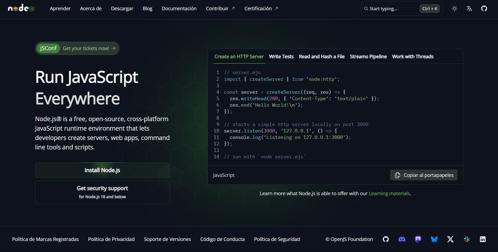
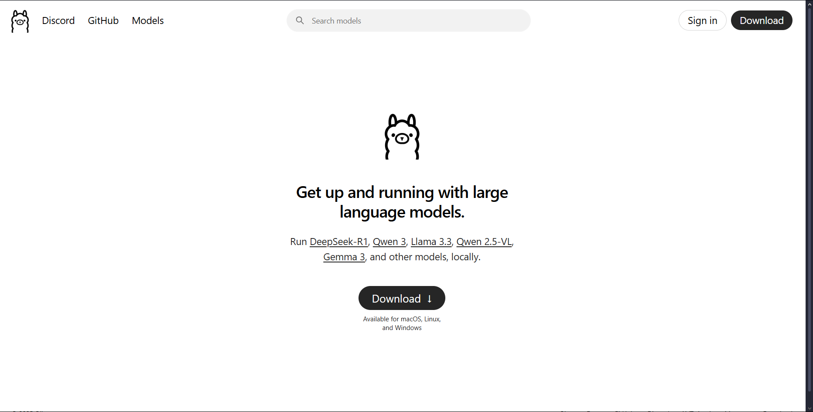

---

## IMPORTANT


For run the scripts files, you *NEED* to have the Node.js library and Ollama library, don't worry, I'm going to explain step by step how to download this libraries ^^.

---

Please follow the next points:

- Node.js, this is the most important library so first you need to download:
    - Visit the following link (https://nodejs.org/es) and click on "_*Install Node.js**_"



-Now, click on the Node.js Installator and following the indications. Once you download the Node.js, now you need to open a cmd window into the _Discord-Bots_ file using right click.


In this moment you can run the bot using :

```bash

node Hatsune-Miku/bot/index.js

```

But, the bot can show you an error, because you need the next library:

- Please visit the Ollama website (https://ollama.com) and click in _*Donwload*_ 



- Follow the installation instructions and in the end, right clikc on your Desktop and execute the next command:

```bash

Ollama run llama3

```

- This command run llama3, the local IA that my bots use.


Now, you can enter into _*Hatsune_Miku*__ file and right click to select the _*Open Terminal*_ option.

Run the next command:

```bash

node bot/index.js

```

Now you can see that Miku it's now Online!!!!


---

Please if you need more help for the installation, send me an email:

> malachisproductions@gmail.com
|
|
|
|
|
|
|
|
|
|
|
|
|
|
|
|
_*If you can image it, you can code it.*_


_*By MALACHIS PRODUCTIONS*_